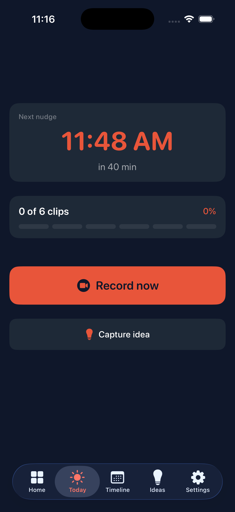
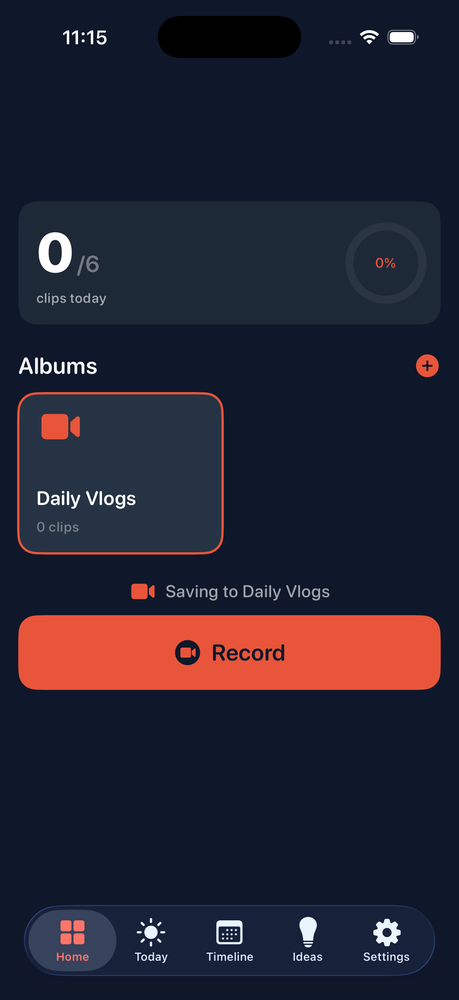
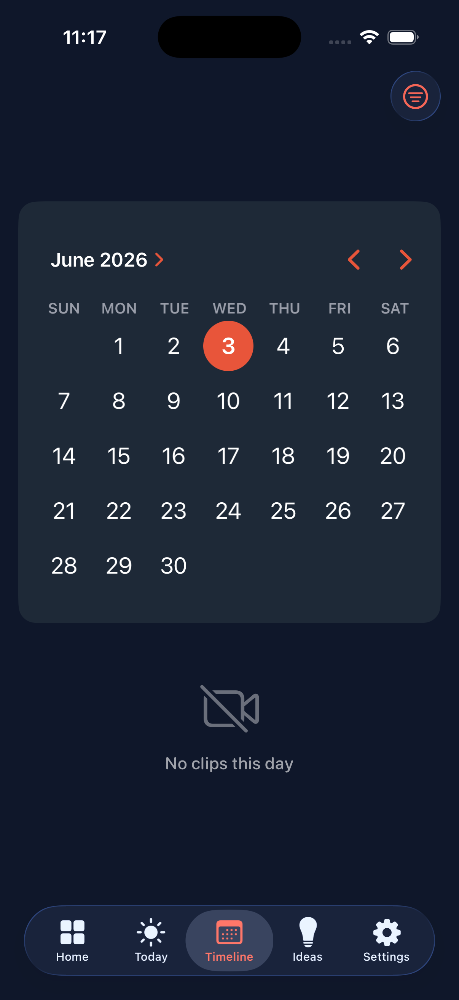
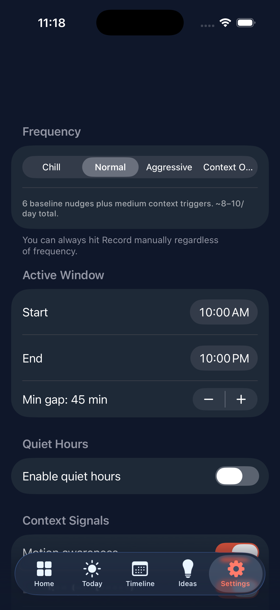
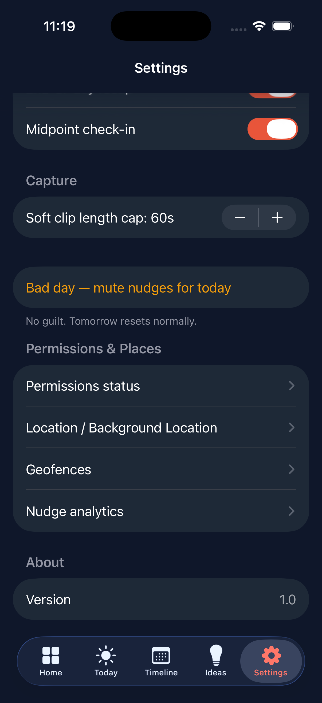

# VlogNudge

**An ADHD-aware iOS app that nudges you to capture day-in-the-life vlog clips — at the right moments, never the annoying ones.**

VlogNudge watches lightweight, on-device context signals (location, motion, calendar, workouts, Focus, time of day) and decides *when* a short "film a clip" reminder is actually welcome. Clips land in a dedicated Photos album ready for a CapCut editing workflow, and a Live Activity keeps the day's pace glanceable on the Lock Screen.

`iOS 17+` · `Swift` · `SwiftUI` · `SwiftData + CloudKit` · `ActivityKit` · `WidgetKit` · `App Intents` · `BackgroundTasks`

---

## Screenshots

<p align="center">
  
  
  
  
  
</p>

## Engineering highlights

- **A pure, deterministic nudge engine.** [`NudgeScorer`](vlognudgee/Services/NudgeScorer.swift) is a side-effect-free function — `(context, settings, history) → decision` — that's trivial to reason about and test. Scheduling, notifications, and persistence are kept strictly separate from the decision logic.
- **Context-aware, not spammy.** Layered *hard blocks* (driving, on a call, Focus mode, quiet hours, cool-downs) gate everything; weighted *positive signals* (arriving somewhere, a meeting just ended, a long gap since the last clip) compete against a user-set sensitivity threshold.
- **Reliable when suspended.** The day's nudges are pre-scheduled as local notifications — the dependable backbone — while `BGAppRefreshTask` only extends the queue into tomorrow. The app never relies on being awake.
- **Live Activity + widgets** driven by a single shared state type compiled into both the app and the widget extension via shared target membership, so the two can't drift.
- **Privacy-first.** All context evaluation happens on device; user data syncs through the user's own private CloudKit database. No backend, no third-party SDKs.
- **Structured logging** via a centralized `os.Logger` per subsystem — no stray `print()`.

## How the nudge engine decides

Every potential nudge moment is scored against the user's current context:

**Hard blocks** — any one suppresses the nudge entirely:
> quiet hours · outside the active window · "bad day" mute · cool-down after repeated dismissals · driving (CoreMotion `automotive`) · on a call · a blocking Focus mode · minimum gap since the last nudge · filmed within the last 30 min

**Positive signals** — summed and compared to a sensitivity threshold derived from the chosen frequency:

| Signal | Weight |
|---|---|
| Geofence transition (arrived at / left a saved place) | +3 |
| Became stationary / just arrived | +2 |
| A calendar event just ended | +2 |
| Long gap since the last clip / no clips past the window midpoint | +2 |
| An event starting soon | +1 |
| Device is charging | +1 |

A nudge fires only when **no hard block applies** *and* the **score clears the threshold** — then [`PromptGenerator`](vlognudgee/Services/PromptGenerator.swift) writes context-appropriate copy ("You just got home — quick clip?").

## Architecture

Layered and single-responsibility, split across two build targets.

```
vlognudgee/                       Main app target (iOS 17+)
├── VlogNudgeApp.swift            App entry + notification-delegate wiring
├── AppState.swift                Observable app state, deep-link routing
├── RootView.swift                Tab shell, onboarding gate, URL handling
├── Models/Models.swift           SwiftData @Models: Clip, VlogAlbum, NudgeEvent,
│                                   Geofence, IdeaMemo, UserSettings (+ ContextSnapshot)
├── Services/                     One responsibility each
│   ├── NudgeScorer.swift             Pure "should we nudge?" decision function
│   ├── NudgeScheduler.swift          Orchestrator: rolling notification queue + BG refresh
│   ├── PromptGenerator.swift         Context-aware prompt copy
│   ├── NotificationService.swift     Categories, action buttons, scheduling
│   ├── NotificationDelegate.swift    Action-button routing
│   ├── LiveActivityController.swift  Daily Live Activity lifecycle
│   ├── RecordingService.swift        AVFoundation capture, vertical lock
│   ├── PhotosService.swift           "Daily Vlogs" album management
│   ├── LocationService.swift         Geofences + significant-location changes
│   ├── MotionService.swift           CoreMotion activity detection
│   ├── CalendarService.swift         EventKit event-end / pre-event triggers
│   ├── HealthService.swift           Workout-end observer (HealthKit)
│   └── FocusService.swift            Focus-mode awareness
├── Features/                     SwiftUI screens
│   ├── Today/ · Home/ · Capture/ · Timeline/ · IdeaMemo/ · Albums/ · Onboarding/
│   └── Settings/                     Settings · Geofence editor · Nudge analytics
├── Intents/AppIntents.swift      Record · Not-now · Skip-hour · Capture-idea
└── Shared/                       App-internal helpers
    ├── AppConstants.swift · AppLogger.swift · DateHelpers.swift
    └── DesignTokens.swift · ColorHex.swift · SharedModelContainer.swift

vlog/                             Widget extension target (iOS 18+)
├── vlogLiveActivity.swift        Live Activity + Dynamic Island
├── vlog.swift                    Home-screen / Lock-screen widgets
├── vlogControl.swift             Control Center / Lock-screen control
├── AppIntent.swift               Widget-side intents
└── vlogBundle.swift              Widget bundle entry

Shared/                           Compiled into BOTH targets
└── VlogNudgeActivityAttributes.swift   Single source of truth for Live Activity state

widget/                           Design source for the widget surfaces — React/JSX
                                   mockups + handoff spec (design reference, not built)
```

The project uses Xcode's **file-system synchronized folders**: every file under a target's folder is compiled automatically, so adding a file is just dropping it in the right directory.

## Build & run

**Requirements:** a recent Xcode, and a **real device** — Live Activities, HealthKit, location, and Focus don't work fully in the Simulator.

1. `open vlognudgee.xcodeproj`
2. **Signing & Capabilities → Team:** select your own Apple Developer team (the project pins a specific `DEVELOPMENT_TEAM`).
3. If building under your own account, point the **App Group** and **iCloud/CloudKit container** IDs at ones your team owns — they live in [`AppConstants.swift`](vlognudgee/Shared/AppConstants.swift) and the target capabilities.
4. Build and run on device, then walk through onboarding (camera/mic/photos/notifications are required; motion/location/calendar/health are optional but make the nudges smart).

More detail — full capability list, permission strings, and Xcode troubleshooting — is in [`docs/SETUP.md`](docs/SETUP.md).

## Design notes

A few decisions worth calling out:

- **Decision logic is a pure function.** Keeping `NudgeScorer` free of side effects makes the "why did/didn't it nudge?" question answerable from inputs alone.
- **Local notifications are the source of truth**, not background execution. Background refresh is treated as best-effort top-up, not a dependency.
- **SwiftData + CloudKit constraints are respected** — every `@Model` property has a default value (a hard requirement for the CloudKit mirror), and the container recreates a fresh store rather than crashing on an incompatible schema during development.
- **No punishment-red in the UI.** Pace tops out at a warm orange — a deliberate, ADHD-friendly tone choice documented in the [widget handoff spec](widget/HANDOFF.md).

## Roadmap

Natural extensions beyond the current build:

- **Calibration mode** — observe the first few days and auto-tune scoring weights toward the nudges that actually convert.
- **Idea-memo transcription** via `SFSpeechRecognizer`.
- **Golden-hour trigger** from solar position (a stub already exists in the scorer's design).
- **CapCut share extension** once a multi-asset import URL scheme is available.

## License

VlogNudge is proprietary — see [LICENSE](LICENSE). The source is public for reference and portfolio purposes; all rights are reserved.
